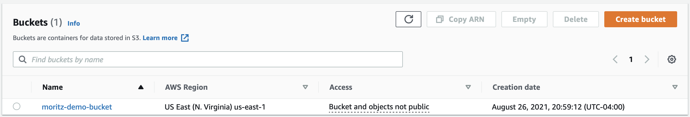
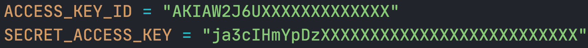

# Connecting python to S3

1. Create a S3 storage bucket. Navigate to AWS S3 and select "Create bucket"  
  
3. Upload a demo file into the bucket using drag&drop in your web browser.
4. Create an AWS user with read/write access to S3. See [this guide](https://www.gormanalysis.com/blog/connecting-to-aws-s3-with-python/) for details. **Download the `Access Key ID` and `Secret Access Key`**
5. Create a file, e.g. `secrets.py`, and define two variable that each contain one of the access key from step (2).  
***DO NOT check this file into github! Everyone with these credentials can read & write data into your bucket!!!***
  

5. See `further_steps.ipynb` notebook.
